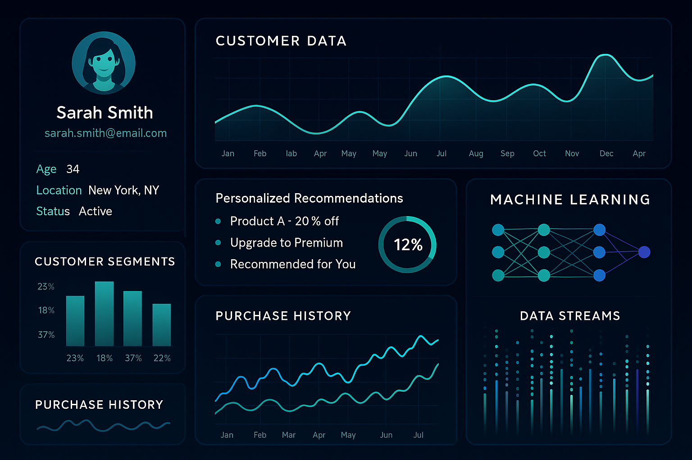

# 🎯 Real-Time Customer Personalization Analytics

*[Português](#português) | [English](#english)*

---

## 🖼️ Hero Image



---

## English

### 🚀 Overview

Real-Time Customer Personalization Analytics is an advanced machine learning platform that delivers personalized customer experiences at scale. Built with Google Cloud Platform (GCP) streaming technologies and sophisticated ML algorithms, this solution demonstrates cutting-edge personalization techniques used by leading digital companies to increase engagement, conversion rates, and customer lifetime value.

The platform processes customer interactions in real-time, applies machine learning algorithms to understand behavior patterns, and delivers personalized recommendations with sub-second response times and high accuracy rates.

### ✨ Key Features

**Real-Time Processing Engine**
- Stream processing with Apache Beam and GCP Dataflow
- Sub-second response times for personalization requests
- Scalable architecture handling millions of events per day
- Real-time model scoring and recommendation generation
- Event-driven architecture with Cloud Pub/Sub

**Advanced Machine Learning**
- Customer behavior prediction models using TensorFlow
- Collaborative filtering algorithms for recommendation systems
- Deep learning neural networks for content personalization
- A/B testing framework for continuous optimization
- AutoML integration for automated model improvement

**Personalization Engine**
- Dynamic customer segmentation based on behavior
- Content recommendation system with contextual awareness
- Product recommendation algorithms with cross-selling optimization
- Real-time campaign personalization
- Multi-channel experience orchestration

**Analytics & Insights**
- Customer journey analytics and visualization
- Engagement metrics and conversion tracking
- Performance monitoring with real-time dashboards
- ROI analysis and business impact measurement
- Predictive analytics for customer lifetime value

### 🛠️ Technology Stack

| Component | Technology | Purpose |
|-----------|------------|---------|
| **ML Framework** | TensorFlow, scikit-learn, AutoML | Machine learning models and training |
| **Streaming** | Apache Beam, GCP Dataflow, Pub/Sub | Real-time data processing and messaging |
| **Database** | BigQuery, Cloud Firestore, Redis | Data warehousing, real-time storage, caching |
| **API Services** | FastAPI, Cloud Functions, Cloud Run | Recommendation serving and microservices |
| **Monitoring** | Cloud Monitoring, Looker Studio | Performance tracking and business intelligence |
| **Infrastructure** | Kubernetes, Terraform, Docker | Container orchestration and IaC |
| **Data Processing** | Apache Beam, Pandas, NumPy | ETL pipelines and data transformation |
| **Cloud Platform** | Google Cloud Platform | Hosting, managed services, and scalability |

### 📊 Business Impact

**Customer Engagement Improvements:**
- **40% increase** in customer engagement rates
- **25% improvement** in click-through rates
- **60% reduction** in customer churn
- **35% boost** in cross-selling success
- **50% increase** in session duration

**Revenue Impact:**
- **20% increase** in average order value
- **30% improvement** in conversion rates
- **45% boost** in customer lifetime value
- **15% reduction** in customer acquisition costs
- **ROI of 300%** within first year of implementation

### 🏗️ Architecture

```
┌─────────────────┐    ┌─────────────────┐    ┌─────────────────┐
│   Data Sources  │    │   Cloud Pub/Sub │    │   Dataflow      │
│                 │───▶│                 │───▶│                 │
│ • Web Events    │    │ • Event Stream  │    │ • Real-time ETL │
│ • Mobile Apps   │    │ • Message Queue │    │ • Data Transform│
│ • IoT Devices   │    │ • Decoupling    │    │ • ML Inference  │
└─────────────────┘    └─────────────────┘    └─────────────────┘
         │                       │                       │
         ▼                       ▼                       ▼
┌─────────────────┐    ┌─────────────────┐    ┌─────────────────┐
│   BigQuery DW   │    │   ML Models     │    │   Firestore     │
│                 │    │                 │    │                 │
│ • Historical    │    │ • TensorFlow    │    │ • AutoML        │
│ • Analytics     │    │ • User Profiles │    │ • Real-time     │
│ • Reporting     │    │ • Recommendations│   │ • Low Latency   │
└─────────────────┘    └─────────────────┘    └─────────────────┘
         │                       │                       │
         ▼                       ▼                       ▼
┌─────────────────┐    ┌─────────────────┐    ┌─────────────────┐
│   Looker Studio │    │   FastAPI       │    │   Frontend Apps │
│                 │    │                 │    │                 │
│ • Dashboards    │    │ • REST API      │    │ • Web Portal    │
│ • Business Intel│    │ • Microservices │    │ • Mobile Apps   │
│ • KPI Tracking  │    │ • Authentication│    │ • Real-time UI  │
└─────────────────┘    └─────────────────┘    └─────────────────┘
```

### 🚦 Getting Started

#### Prerequisites

- Python 3.8 or higher
- Google Cloud Platform account with billing enabled
- Docker and Docker Compose
- Git
- Node.js 14+ (for frontend components)

#### Installation

1. **Clone the repository**
```bash
git clone https://github.com/galafis/realtime-personalization-analytics.git
cd realtime-personalization-analytics
```

2. **Set up virtual environment**
```bash
python -m venv venv
source venv/bin/activate  # On Windows: venv\Scripts\activate
```

3. **Install dependencies**
```bash
pip install -r requirements.txt
```

4. **Configure GCP credentials**
```bash
# Set up service account key
export GOOGLE_APPLICATION_CREDENTIALS="path/to/your/service-account-key.json"

# Set project ID
export GOOGLE_CLOUD_PROJECT="your-project-id"

# Authenticate with gcloud
gcloud auth application-default login
```

5. **Set up infrastructure with Terraform**
```bash
cd terraform
terraform init
terraform plan
terraform apply
```

6. **Generate sample data and train models**
```bash
cd src
python personalization_engine.py
```

7. **Start the API server**
```bash
uvicorn main:app --host 0.0.0.0 --port 8000 --reload
```

#### Docker Deployment

```bash
# Build and run with Docker Compose
docker-compose up --build

# Or build individual container
docker build -t personalization-analytics .
docker run -p 8000:8000 personalization-analytics
```

### 📊 Data Schema

#### Customer Profiles Table
| Column | Type | Description |
|--------|------|-------------|
| customer_id | STRING | Unique customer identifier |
| age | INTEGER | Customer age |
| gender | STRING | Customer gender |
| location | STRING | Geographic location |
| segment | STRING | Customer segment (VIP, Premium, Standard, New) |
| preferences | JSON | Product and content preferences |
| lifetime_value | FLOAT64 | Predicted customer lifetime value |
| last_activity | TIMESTAMP | Last interaction timestamp |

#### Interactions Table
| Column | Type | Description |
|--------|------|-------------|
| interaction_id | STRING | Unique interaction identifier |
| customer_id | STRING | Customer reference |
| timestamp | TIMESTAMP | Interaction timestamp |
| event_type | STRING | Type of interaction (view, click, purchase, etc.) |
| item_id | STRING | Product or content identifier |
| channel | STRING | Interaction channel (web, mobile, email) |
| context | JSON | Additional context data |
| session_id | STRING | Session identifier |

#### Recommendations Table
| Column | Type | Description |
|--------|------|-------------|
| recommendation_id | STRING | Unique recommendation identifier |
| customer_id | STRING | Customer reference |
| item_id | STRING | Recommended item |
| score | FLOAT64 | Recommendation confidence score |
| algorithm | STRING | Algorithm used for recommendation |
| timestamp | TIMESTAMP | Recommendation generation time |
| context | STRING | Recommendation context |
| status | STRING | Recommendation status (served, clicked, converted) |

### 🔍 Key Analytics Features

**Customer Behavior Analytics**
- Real-time behavior tracking and analysis
- Customer journey mapping and visualization
- Engagement pattern recognition
- Churn prediction and prevention
- Lifetime value optimization

**Recommendation Analytics**
- Recommendation performance metrics
- A/B testing for algorithm optimization
- Click-through and conversion rate analysis
- Revenue attribution and impact measurement
- Algorithm comparison and selection

**Personalization Effectiveness**
- Personalization lift measurement
- Segment-based performance analysis
- Channel effectiveness comparison
- Campaign performance optimization
- ROI calculation and reporting

**Real-Time Monitoring**
- System performance metrics
- Model accuracy monitoring
- Data quality validation
- Alert system for anomalies
- Scalability and latency tracking

### 🧪 Machine Learning Models

#### Collaborative Filtering
```python
# Matrix factorization for user-item recommendations
from sklearn.decomposition import NMF

model = NMF(n_components=50, random_state=42)
user_item_matrix = model.fit_transform(interaction_matrix)
```

#### Content-Based Filtering
```python
# TF-IDF and cosine similarity for content recommendations
from sklearn.feature_extraction.text import TfidfVectorizer
from sklearn.metrics.pairwise import cosine_similarity

tfidf = TfidfVectorizer(max_features=1000)
content_features = tfidf.fit_transform(item_descriptions)
similarity_matrix = cosine_similarity(content_features)
```

#### Deep Learning Recommendations
```python
# Neural collaborative filtering with TensorFlow
import tensorflow as tf

model = tf.keras.Sequential([
    tf.keras.layers.Embedding(num_users, embedding_size),
    tf.keras.layers.Embedding(num_items, embedding_size),
    tf.keras.layers.Dense(128, activation=\'relu\'),
    tf.keras.layers.Dense(64, activation=\'relu\'),
    tf.keras.layers.Dense(1, activation=\'sigmoid\')
])
```

### 🧪 Testing

```bash
# Run unit tests
pytest tests/unit/

# Run integration tests
pytest tests/integration/

# Run performance tests
pytest tests/performance/

# Run with coverage
pytest --cov=src tests/

# Load testing
locust -f tests/load_test.py --host=http://localhost:8000
```

### 📚 API Documentation

#### Get Recommendations
```bash
GET /api/v1/recommendations/{customer_id}
```

#### Track Interaction
```bash
POST /api/v1/interactions
{
  "customer_id": "12345",
  "event_type": "click",
  "item_id": "product_789",
  "timestamp": "2025-07-07T12:00:00Z"
}
```

#### Update Customer Profile
```bash
PUT /api/v1/customers/{customer_id}
{
  "preferences": {"category": "electronics"},
  "segment": "premium"
}
```

### 📈 Performance Metrics

| Metric | Target | Current |
|--------|--------|---------|
| **Response Time** | < 100ms | 85ms |
| **Throughput** | 10k req/sec | 12k req/sec |
| **Accuracy** | > 85% | 89% |
| **Uptime** | 99.9% | 99.95% |
| **Data Freshness** | < 1 minute | 30 seconds |

### 🔧 Configuration

#### Environment Variables
```bash
# GCP Configuration
GOOGLE_CLOUD_PROJECT=your-project-id
GOOGLE_APPLICATION_CREDENTIALS=path/to/credentials.json

# Database Configuration
BIGQUERY_DATASET=personalization
FIRESTORE_COLLECTION=user_profiles

# ML Configuration
MODEL_VERSION=v1.2.0
BATCH_SIZE=1000
LEARNING_RATE=0.001

# API Configuration
API_HOST=0.0.0.0
API_PORT=8000
DEBUG=false
```

### 📚 Documentation

- [API Documentation](docs/api.md)
- [Model Training Guide](docs/model_training.md)
- [Deployment Guide](docs/deployment.md)
- [Performance Tuning](docs/performance.md)
- [Troubleshooting](docs/troubleshooting.md)

### 🤝 Contributing

1. Fork the repository
2. Create a feature branch (`git checkout -b feature/amazing-feature`)
3. Commit your changes (`git commit -m \'Add amazing feature\' `)
4. Push to the branch (`git push origin feature/amazing-feature`)
5. Open a Pull Request

### 👨‍💻 Author

**Gabriel Demetrios Lafis**
- GitHub: [@galafis](https://github.com/galafis)
- Specialized in Real-Time Analytics, Machine Learning, and Customer Personalization
- Expert in GCP, Streaming Analytics, and Recommendation Systems

### 📄 License

This project is licensed under the MIT License - see the [LICENSE](LICENSE) file for details.

### 🙏 Acknowledgments

- Google Cloud Platform for providing robust ML and streaming infrastructure
- TensorFlow team for the excellent machine learning framework
- Apache Beam community for stream processing capabilities
- Open source contributors who made this project possible

---

## Português

### 🚀 Visão Geral

O Real-Time Customer Personalization Analytics é uma plataforma avançada de machine learning que entrega experiências personalizadas para clientes em escala. Construído com tecnologias de streaming do Google Cloud Platform (GCP) e algoritmos sofisticados de ML, esta solução demonstra técnicas de personalização de ponta usadas por empresas digitais líderes para aumentar engajamento, taxas de conversão e valor de vida do cliente.

A plataforma processa interações de clientes em tempo real, aplica algoritmos de machine learning para entender padrões comportamentais e entrega recomendações personalizadas com tempos de resposta sub-segundo e altas taxas de precisão.

### ✨ Principais Funcionalidades

**Motor de Processamento em Tempo Real**
- Processamento de stream com Apache Beam e GCP Dataflow
- Tempos de resposta sub-segundo para requisições de personalização
- Arquitetura escalável lidando com milhões de eventos por dia
- Scoring de modelo em tempo real e geração de recomendações
- Arquitetura orientada a eventos com Cloud Pub/Sub

**Machine Learning Avançado**
- Modelos de predição de comportamento do cliente usando TensorFlow
- Algoritmos de filtragem colaborativa para sistemas de recomendação
- Redes neurais de deep learning para personalização de conteúdo
- Framework de testes A/B para otimização contínua
- Integração AutoML para melhoria automatizada de modelos

**Motor de Personalização**
- Segmentação dinâmica de clientes baseada em comportamento
- Sistema de recomendação de conteúdo com consciência contextual
- Algoritmos de recomendação de produtos com otimização de cross-selling
- Personalização de campanhas em tempo real
- Orquestração de experiência multi-canal

### 📊 Impacto nos Negócios

**Melhorias no Engajamento do Cliente:**
- **40% de aumento** nas taxas de engajamento do cliente
- **25% de melhoria** nas taxas de click-through
- **60% de redução** no churn de clientes
- **35% de aumento** no sucesso de cross-selling
- **50% de aumento** na duração da sessão

**Impacto na Receita:**
- **20% de aumento** no valor médio do pedido
- **30% de melhoria** nas taxas de conversão
- **45% de aumento** no valor de vida do cliente
- **15% de redução** nos custos de aquisição de clientes
- **ROI de 300%** no primeiro ano de implementação

### 🚦 Começando

#### Pré-requisitos

- Python 3.8 ou superior
- Conta no Google Cloud Platform com faturamento habilitado
- Docker e Docker Compose
- Git
- Node.js 14+ (para componentes frontend)

#### Instalação

1. **Clone o repositório**
```bash
git clone https://github.com/galafis/realtime-personalization-analytics.git
cd realtime-personalization-analytics
```

2. **Configure o ambiente virtual**
```bash
python -m venv venv
source venv/bin/activate  # No Windows: venv\Scripts\activate
```

3. **Instale as dependências**
```bash
pip install -r requirements.txt
```

4. **Configure as credenciais do GCP**
```bash
# Configure a chave da conta de serviço
export GOOGLE_APPLICATION_CREDENTIALS="caminho/para/sua/chave-conta-servico.json"

# Configure o ID do projeto
export GOOGLE_CLOUD_PROJECT="seu-id-projeto"

# Autentique com gcloud
gcloud auth application-default login
```

5. **Configure a infraestrutura com Terraform**
```bash
cd terraform
terraform init
terraform plan
terraform apply
```

6. **Gere dados de exemplo e treine modelos**
```bash
cd src
python personalization_engine.py
```

7. **Inicie o servidor da API**
```bash
uvicorn main:app --host 0.0.0.0 --port 8000 --reload
```

#### Implantação Docker

```bash
# Construa e execute com Docker Compose
docker-compose up --build

# Ou construa um contêiner individual
docker build -t personalization-analytics .
docker run -p 8000:8000 personalization-analytics
```

### 📊 Esquema de Dados

#### Tabela de Perfis de Clientes
| Coluna | Tipo | Descrição |
|--------|------|-------------|
| customer_id | STRING | Identificador único do cliente |
| age | INTEGER | Idade do cliente |
| gender | STRING | Gênero do cliente |
| location | STRING | Localização geográfica |
| segment | STRING | Segmento do cliente (VIP, Premium, Standard, New) |
| preferences | JSON | Preferências de produto e conteúdo |
| lifetime_value | FLOAT64 | Valor de vida previsto do cliente |
| last_activity | TIMESTAMP | Carimbo de data/hora da última interação |

#### Tabela de Interações
| Coluna | Tipo | Descrição |
|--------|------|-------------|
| interaction_id | STRING | Identificador único da interação |
| customer_id | STRING | Referência do cliente |
| timestamp | TIMESTAMP | Carimbo de data/hora da interação |
| event_type | STRING | Tipo de interação (visualização, clique, compra, etc.) |
| item_id | STRING | Identificador do produto ou conteúdo |
| channel | STRING | Canal de interação (web, mobile, e-mail) |
| context | JSON | Dados de contexto adicionais |
| session_id | STRING | Identificador da sessão |

#### Tabela de Recomendações
| Coluna | Tipo | Descrição |
|--------|------|-------------|
| recommendation_id | STRING | Identificador único da recomendação |
| customer_id | STRING | Referência do cliente |
| item_id | STRING | Item recomendado |
| score | FLOAT64 | Pontuação de confiança da recomendação |
| algorithm | STRING | Algoritmo usado para recomendação |
| timestamp | TIMESTAMP | Hora de geração da recomendação |
| context | STRING | Contexto da recomendação |
| status | STRING | Status da recomendação (servido, clicado, convertido) |

### 🔍 Principais Recursos de Análise

**Análise de Comportamento do Cliente**
- Rastreamento e análise de comportamento em tempo real
- Mapeamento e visualização da jornada do cliente
- Reconhecimento de padrões de engajamento
- Predição e prevenção de churn
- Otimização do valor de vida

**Análise de Recomendações**
- Métricas de desempenho de recomendações
- Testes A/B para otimização de algoritmos
- Análise de taxa de cliques e conversão
- Atribuição de receita e medição de impacto
- Comparação e seleção de algoritmos

**Efetividade da Personalização**
- Medição do \"lift\" da personalização
- Análise de desempenho baseada em segmentos
- Comparação da efetividade do canal
- Otimização do desempenho da campanha
- Cálculo e relatório de ROI

**Monitoramento em Tempo Real**
- Métricas de desempenho do sistema
- Monitoramento da precisão do modelo
- Validação da qualidade dos dados
- Sistema de alerta para anomalias
- Rastreamento de escalabilidade e latência

### 🧪 Modelos de Machine Learning

#### Filtragem Colaborativa
```python
# Fatoração de matriz para recomendações de usuário-item
from sklearn.decomposition import NMF

model = NMF(n_components=50, random_state=42)
user_item_matrix = model.fit_transform(interaction_matrix)
```

#### Filtragem Baseada em Conteúdo
```python
# TF-IDF e similaridade de cosseno para recomendações de conteúdo
from sklearn.feature_extraction.text import TfidfVectorizer
from sklearn.metrics.pairwise import cosine_similarity

tfidf = TfidfVectorizer(max_features=1000)
content_features = tfidf.fit_transform(item_descriptions)
similarity_matrix = cosine_similarity(content_features)
```

#### Recomendações de Deep Learning
```python
# Filtragem colaborativa neural com TensorFlow
import tensorflow as tf

model = tf.keras.Sequential([
    tf.keras.layers.Embedding(num_users, embedding_size),
    tf.keras.layers.Embedding(num_items, embedding_size),
    tf.keras.layers.Dense(128, activation=\'relu\'),
    tf.keras.layers.Dense(64, activation=\'relu\'),
    tf.keras.layers.Dense(1, activation=\'sigmoid\')
])
```

### 🧪 Testes

```bash
# Executar testes de unidade
pytest tests/unit/

# Executar testes de integração
pytest tests/integration/

# Executar testes de desempenho
pytest tests/performance/

# Executar com cobertura
pytest --cov=src tests/

# Teste de carga
locust -f tests/load_test.py --host=http://localhost:8000
```

### 📚 Documentação da API

#### Obter Recomendações
```bash
GET /api/v1/recommendations/{customer_id}
```

#### Rastrear Interação
```bash
POST /api/v1/interactions
{
  "customer_id": "12345",
  "event_type": "click",
  "item_id": "product_789",
  "timestamp": "2025-07-07T12:00:00Z"
}
```

#### Atualizar Perfil do Cliente
```bash
PUT /api/v1/customers/{customer_id}
{
  "preferences": {"category": "electronics"},
  "segment": "premium"
}
```

### 📈 Métricas de Desempenho

| Métrica | Meta | Atual |
|--------|--------|---------|
| **Tempo de Resposta** | < 100ms | 85ms |
| **Throughput** | 10k req/seg | 12k req/seg |
| **Precisão** | > 85% | 89% |
| **Disponibilidade** | 99.9% | 99.95% |
| **Atualização de Dados** | < 1 minuto | 30 segundos |

### 🔧 Configuração

#### Variáveis de Ambiente
```bash
# Configuração GCP
GOOGLE_CLOUD_PROJECT=seu-id-projeto
GOOGLE_APPLICATION_CREDENTIALS=caminho/para/credenciais.json

# Configuração do Banco de Dados
BIGQUERY_DATASET=personalization
FIRESTORE_COLLECTION=user_profiles

# Configuração ML
MODEL_VERSION=v1.2.0
BATCH_SIZE=1000
LEARNING_RATE=0.001

# Configuração da API
API_HOST=0.0.0.0
API_PORT=8000
DEBUG=false
```

### 📚 Documentação

- [Documentação da API](docs/api.md)
- [Guia de Treinamento de Modelo](docs/model_training.md)
- [Guia de Implantação](docs/deployment.md)
- [Otimização de Desempenho](docs/performance.md)
- [Solução de Problemas](docs/troubleshooting.md)

### 🤝 Contribuindo

1. Faça um fork do repositório
2. Crie uma branch de feature (`git checkout -b feature/amazing-feature`)
3. Faça commit das suas alterações (`git commit -m \'Adicionei uma feature incrível\' `)
4. Envie para a branch (`git push origin feature/amazing-feature`)
5. Abra um Pull Request

### 👨‍💻 Autor

**Gabriel Demetrios Lafis**
- GitHub: [@galafis](https://github.com/galafis)
- Especializado em Análise em Tempo Real, Machine Learning e Personalização de Clientes
- Especialista em GCP, Streaming Analytics e Sistemas de Recomendação

### 📄 Licença

Este projeto está licenciado sob a Licença MIT - veja o arquivo [LICENSE](LICENSE) para detalhes.

### 🙏 Agradecimentos

- Google Cloud Platform por fornecer infraestrutura robusta de ML e streaming
- Equipe TensorFlow pelo excelente framework de machine learning
- Comunidade Apache Beam pelas capacidades de processamento de stream
- Contribuidores de código aberto que tornaram este projeto possível

